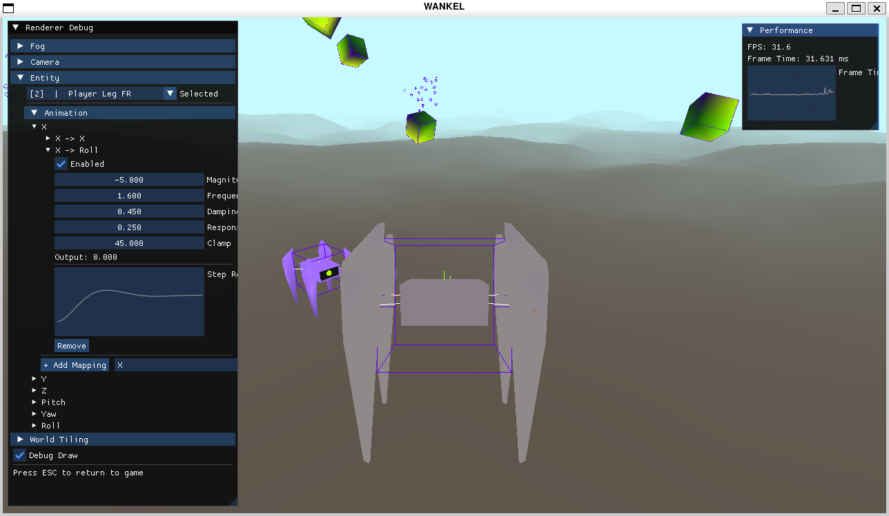
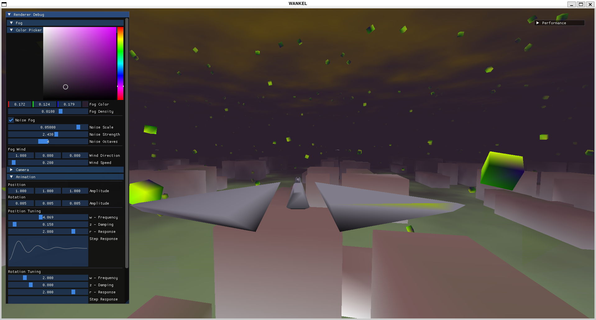

# Wankel
Game Engine designed for 3D Rendering and Physics. SandboxApp Example lets you fly a ship.
Right now there is only AABB collisions with the ship and the Green cubes (So all other mesh 
can be flown through).  

Right now I do all development from terminal (Vim), usually on Linux. I have tested and built in both 
Linux and Windows from terminal / PowerShell.





## REQUIREMENTS:
g++ 13+ for entt
.. Probably other things I need to add here


## EXAMPLE SETUP:
### Initialize Submodules:
```bash
git submodule update --init --recursive
```
#### LINUX:
##### Requirements:
- TBD

##### To run:
```bash
./scripts/build.sh
cd Sandbox
./build.sh
./run.sh
```


#### WINDOWS:
##### Requirements:
- MSVC compiler from Visual Studio Build Tools 2022 -> https://visualstudio.microsoft.com/visual-cpp-build-tools/?utm_source=chatgpt.com
- Ninja 
- Cmake
```bash
winget install Ninja-build.Ninja
winget install Kitware.CMake
```

##### To run:
```bash
.\scripts\build.bat
cd Sandbox
.\build.bat
.\run.bat
```


## DEV TOOLING:
Requires `clang-format` and `clang-tidy` (LLVM 18+ recommended) on PATH.

```bash
./scripts/format.sh          # reformat all first-party source in place
./scripts/format-check.sh    # check formatting, non-zero exit if anything's off
./scripts/lint.sh            # clang-tidy against an existing build (run build.sh first)
./scripts/lint.sh -fix       # same, applying auto-fixes where clang-tidy can
```

Sanitizers are wired into the CMake build (both `scripts/build.sh` and
`Sandbox/build.sh`) via a `SANITIZE` env var - use a separate `BUILD_DIR` since
the flags differ from a normal build:
```bash
BUILD_DIR=build-asan SANITIZE=address,undefined ./scripts/build.sh
```
UndefinedBehaviorSanitizer isn't supported on MSVC; `SANITIZE=address` works there.


## Sandbox App Controls:
### MNK:
- W - Forward
- A - Left
- S - Backward
- D - Right
- Q - Roll Left
- E - Roll Right
- SPACE - Up
- Left Ctrl - Down
- Mouse - Pitch & Yaw
- Exc - Unlock Mouse
- Left Shift - Boost/Sprint
- X - Switch look mode (FPS to Start, FLIGHT)

### Controller (PS4 Notation):
- L Stick - Forward/Left/Backward/Right
- R Stick - Pitch & Yaw
- L2 - Roll Left
- R2 - Roll Right
- Cross - Up
- Circle - Down
- L3 - Boost/Sprint
- R3 - Switch look mode (FPS to Start, FLIGHT)


## FEATURES:
- Linux / Windows split
- Event system
- Window system
- ECS using Entt
- Camera
- ImGui
- Logging
- Application and entry point
- Mouse and Keyboard input
- Controller Input
- Simple Renderer (OpenGL)
- Sandbox example
- AABB Collision
- Raycast/collision queries
- Sphere vs AABB Collision
- Second Order Dynamics Animation System
- Multi-mesh components
- Debug Visualization system (coord. frames etc.)
- Collision box debug rendering
- Unified collider dispatch (table-based, keyed on collider type, extensible to new shapes)


## TODO:
- Capsule collision systems
- Static triangle mesh collision
- Lighting/Material pipeline
- Update 3d mesh system to read other files (glTF) and add normals to .ply
- Text Rendering
- Basic UI/HUD Framework
- Asset/Material separation
- Asset manager
- Procedural Animation Layering (I need to evaluate if I want this)
- State machine helpers
- Audio System
- Multiplayer Networking
- Database System (may be SQL)
- Update Debug Lines to support thickness


## BUGS:
- Cant push an entity across the world border because the teleport doesnt work with colliders. 
